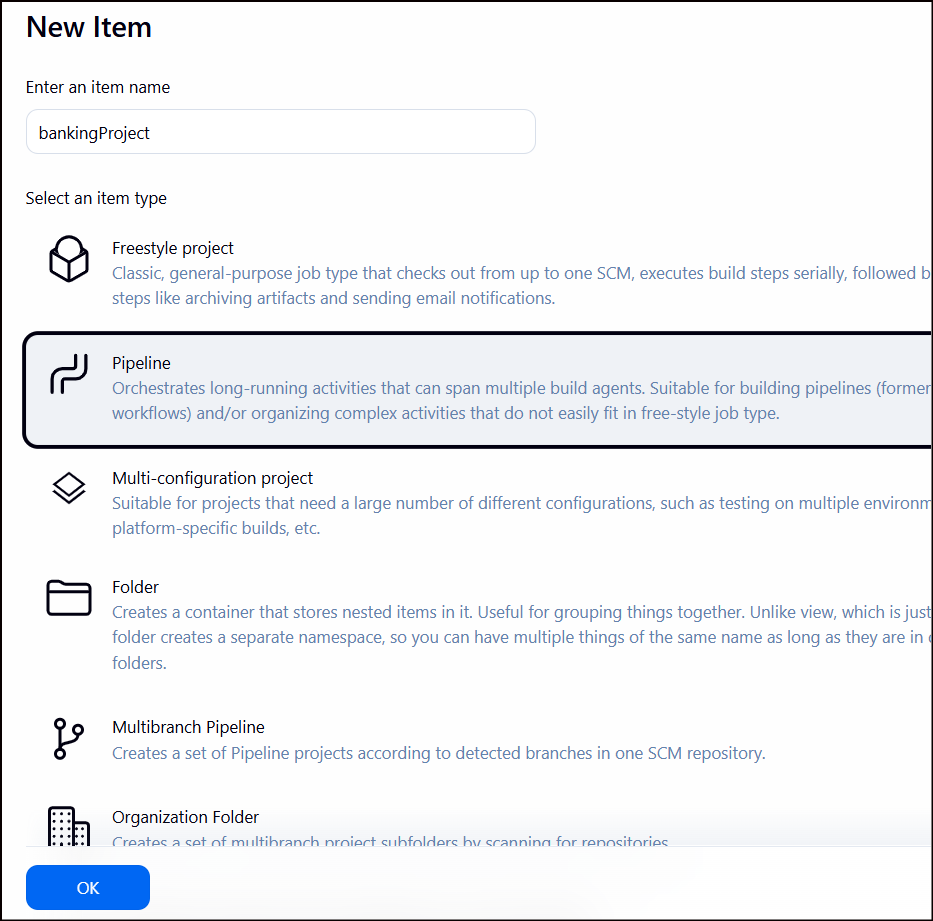
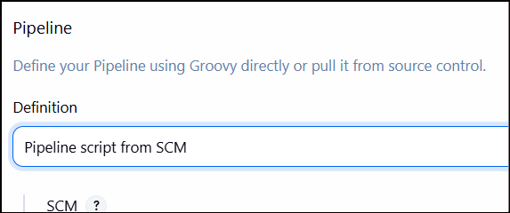
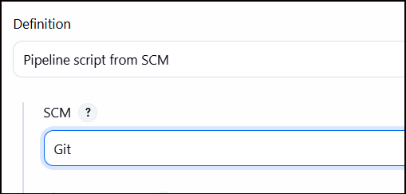
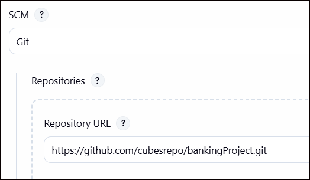
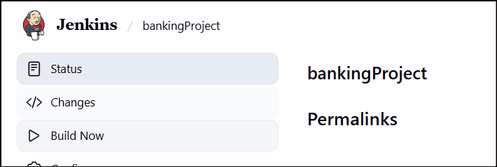

**Hello**🖐 **Automated Testing for bankingProject Demo Website with (Selenium, Pytest, Page Object Model(POM), Allure Reports, Jenkins Pipeline)**

This project covers automated tests for the bankingProject (BANKING) demo site, focusing on the core user flows such as valid login, successful deposit, successful withdrawal, and verifying the transaction history after each action.
Aside from the main scenarios, I also checked several edge cases to see how the system behaves when users perform unusual or invalid actions. 
These include:
   - Trying to log in without selecting a username 
   - Submitting a deposit with empty fields 
   - Depositing with a 0 amount 
   - Attempting to withdraw with no available balance
___________________________________________

🎯 **Pre-requisites:**
- Python 3.11.9
- Any browsers(Chrome, Firefox, Edge)
___________________________________________

▶ **Test Execution**

Run commands: 
1. Install Dependecies:

       pip install -r requirements.txt
2. Run the test with Allure report:

       pytest -v --alluredir=reports/TestCase1
   or specifying browser

       pytest -v --browser=edge --alluredir=reports/TestCase1
    

**To run this on jenkins**
1. Add item name, click Pipeline and click OK
    
    
2. Scroll down and navigate to Pipeline then select "pipeline script from SCM"
    
   
3. Select Git
    
   
4. Paste the Repo URL and click Apply and Save
    
   
5. Click build now
    
   

    
   
   
    
