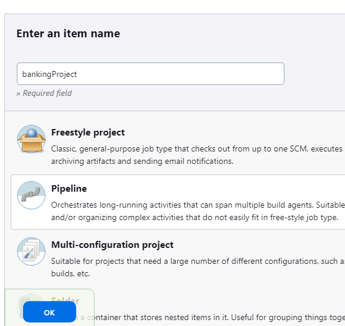
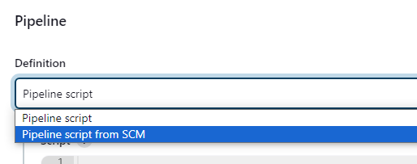
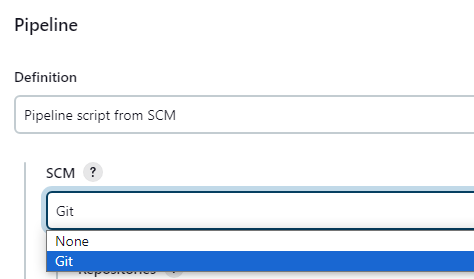
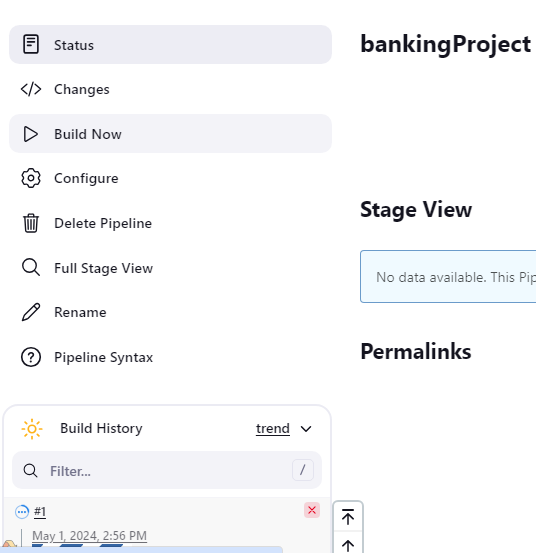

**Hello**🖐 **Automated Testing for automationExercise Demo Website with Selenium (Pytest, POM, HTML Reports, Jenkins Pipeline)**

This project tests various functionalities of the automationExercise(E-COMMERCE) demo website, such as register, add to cart, remove products in cart,  and place order.
___________________________________________

🎯 **Pre-requisites:**
- Python 3
- Any browsers(Chrome, Firefox, Edge)
___________________________________________

▶ **Test Execution**

Run commands: 
1. Install Dependecies:

       pip install -r requirements.txt
2. Run the test with html report:

       pytest -v --html=report.html 
   or specifying browser

       pytest -v --browser=edge --html=report.html
    

**To run this on jenkins**

1. Add item name, click Pipeline and click OK

   
2. Scroll down find Pipeline and Select pipeline script from SCM

   
3. Choose GIT

   
4. Enter the repo URL and click and save

   
5. Click build now

   

    
   
   
    
